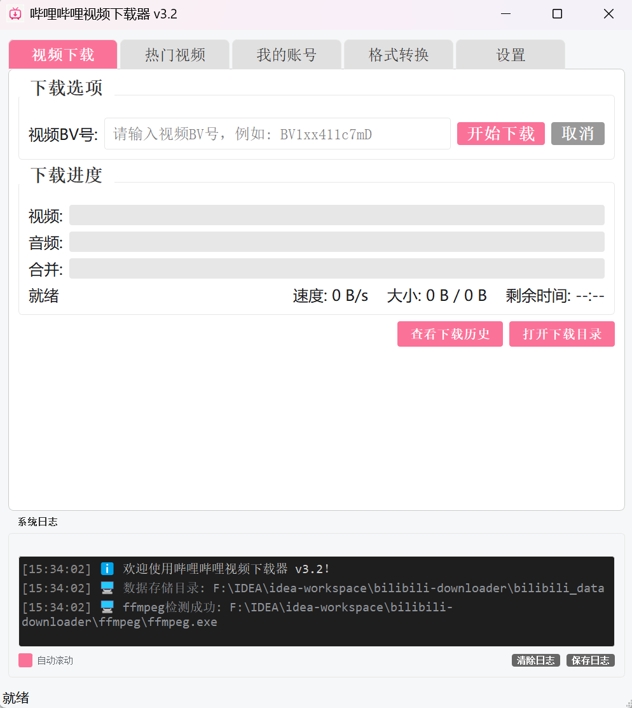

# Bilibili Downloader (哔哩哔哩视频下载器)

[](LICENSE)
[](https://www.python.org/downloads/)

一个简洁、易用的B站视频下载工具，支持图形界面(GUI)和命令行(CLI)操作。

 (如果有截图请替换)

## ✨ 功能特性

*   **高清下载**：支持下载1080P、4K等高清视频（需登录大会员账号）。
*   **视频合并**：自动合并视频流和音频流，输出完整的MP4文件。
*   **断点续传**：支持网络中断后的断点续传。
*   **热门视频**：查看并下载B站热门视频。
*   **去水印**：(实验性) 支持去除视频右上角水印。
*   **多平台**：支持Windows、Linux和macOS（需自行配置ffmpeg）。
*   **双模式**：提供直观的GUI界面和高效的命令行模式。

## 📦 安装与运行

### 依赖环境

*   Python 3.8 或更高版本
*   ffmpeg (用于视频合并和处理)

### 安装步骤

1.  克隆或下载本项目代码。
2.  安装Python依赖：
    ```bash
    pip install -r requirements.txt
    ```
3.  确保 `ffmpeg` 可用：
    *   Windows: 将 `ffmpeg.exe` 放入项目根目录下的 `ffmpeg/` 文件夹中，或添加到系统环境变量 PATH 中。
    *   Linux/macOS: 使用包管理器安装 (e.g., `apt install ffmpeg` or `brew install ffmpeg`)。

### 运行程序

**启动图形界面 (GUI):**
```bash
python main.py
```

**使用命令行 (CLI):**
```bash
# 下载指定视频
python main.py -d BV1xx411c7mD

# 爬取热门视频
python main.py -p --pages 3
```

## 🛠️ 开发构建

本项目使用 PyInstaller 进行打包。

```bash
python build.py
```
构建完成后，可执行文件将位于 `dist/bilibili_downloader/` 目录。

## 📝 版本历史

### v1.9 (2025-11-30)
*   **优化**: 登录弹窗二维码显示区域调整为正方形，防止变形。
*   **优化**: 视频下载取消逻辑，支持释放资源并删除残留文件。
*   **优化**: 设置界面布局调整，移除冗余描述。
*   **新增**: 登录用户可查看观看历史记录，并支持双击直接下载。
*   **新增**: 应用程序图标支持。

### v1.8 (2025-11-30)
*   **修复**: 登录后分辨率选项不显示1080p及大会员4K选项的问题。
*   **优化**: 调整登录弹窗大小，解决二维码缩小变形的问题。
*   **优化**: 调整启动弹窗大小，提升阅读体验。
*   **安全**: 新增退出软件时自动清除登录信息的功能。
*   **优化**: 确保所有设置选项正确生效。

### v1.7 (2025-11-30)
*   **优化**: 设置界面布局重构，移除冗余选项。
*   **新增**: 启动弹窗公告，显示版本更新内容。
*   **新增**: 智能分辨率选择，根据登录状态和权益自动显示可用画质。
*   **修复**: 收藏夹列表时间显示问题。
*   **优化**: 移除了界面顶部的冗余标题栏。

### v1.6 (2025-11-30)
*   **新增**: 支持下载弹幕（XML/JSON）和评论（JSON）。
*   **优化**: 控制台日志输出更加简洁直观。
*   **修复**: 登录二维码生成失败的问题。
*   **修复**: 部分视频去水印时可能出现的计算错误。
*   **增强**: 完善了核心功能的单元测试覆盖。

### v1.5 (2025-11-30)
*   **新增**: 完整的去水印功能 (自动探测分辨率并应用delogo滤镜)。
*   **优化**: 用户登录后自动下载最高画质 (4K/1080P+)。
*   **修复**: 合并后删除原文件选项无效的问题。
*   **修复**: 重新下载已存在视频时的报错问题。
*   **重构**: 视频处理模块 (Processor) 独立并增强稳定性。
*   **优化**: 设置选项实时生效，无需重启。

### v1.4 (2025-11-30)
*   **重构**: 核心代码模块化 (Network, API, Downloader, Processor)。
*   **新增**: 实验性去水印功能。
*   **优化**: UI响应速度和错误处理。
*   **移除**: 废弃的搜索和用户信息查询功能。

### v1.3
*   移除搜索功能，精简界面。

## ⚠️ 免责声明

本项目仅供学习和个人使用，请勿用于商业用途或侵犯他人版权。下载的视频版权归原作者所有。
